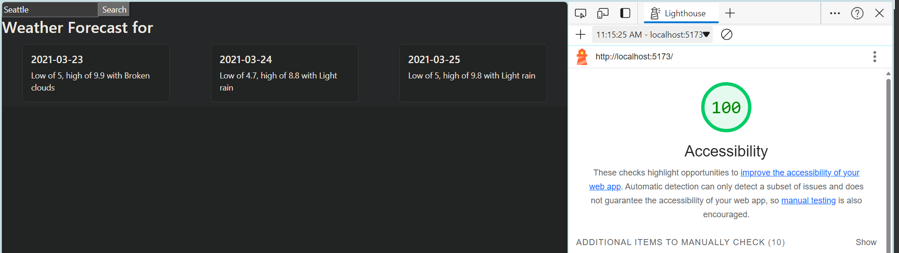

# React + Vite

This template provides a minimal setup to get React working in Vite with HMR and some ESLint rules.

Currently, two official plugins are available:

- [@vitejs/plugin-react](https://github.com/vitejs/vite-plugin-react/blob/main/packages/plugin-react/README.md) uses [Babel](https://babeljs.io/) for Fast Refresh
- [@vitejs/plugin-react-swc](https://github.com/vitejs/vite-plugin-react-swc) uses [SWC](https://swc.rs/) for Fast Refresh
# city-explorer-api-server

4/5 Cache feature lab 10# Project Name: Weather Application

**Author**: Qilin Xie
**Version**: 1.5.0 

## Overview
This project involves building a weather application that allows users to search for weather forecasts by city name. The application consists of a frontend written in React, where users can input a city name, and a backend server that fetches weather data from external APIs.

## Getting Started
I set up both the frontend and backend components. Begin by constructing the backend system to fetch required data from relevant APIs. Then, create a frontend interface for user interaction where users can input a city name to view the weather forecast.

## Architecture
The application is built with Axios, Cors, and Express.

## Change Log
### Frontend:
- [4/5 3pm] Implemented caching feature to improve performance.

### Backend:
- [4/5 3pm] Integrated caching mechanism for efficient data retrieval.

## Credit and Collaborations
Thanks to ChatGPT for assistance.

## Time Estimates
1. **Cache Feature Implementation**
   - **Estimate**: 1 hour
   - **Start Time**: 1:00 PM
   - **Finish Time**: 2:00 PM
   - **Actual Time**: 1 hour

2. **Integrating Yelp API**
   - **Estimate**: 30 minutes
   - **Start Time**: 2:30 PM
   - **Finish Time**: 3:05 PM
   - **Actual Time**: 35 minutes
   
accessibility scores: 

4/4 Weather/Movie feature lab 9
**Author**: Qilin Xie
**Version**: 1.4.0 (increment the patch/fix version number if you make more commits past your first submission)
r
## Overview
building a weather application that allows users to search for weather forecasts by city name. The application consists of a frontend written in React, where users can input a city name, and a backend server that fetches weather data from a JSON file or an external API.

## Getting Started
Begin by constructing a backend system to fetch required data from relevant APIs, and create a frontend interface for user interaction.

## Architecture
Built with Axios, Cors, Express.

## Change Log
front end: 
4/4 4:30pm updates readme.md
4/4 4:15pm refactored front end codes and adds modules/location.js, 
4/4 2:30pm updates maps and previous features from lab7

back end: 
4/4 4:30pm updates readme.md
4/4modifies app.jsx to fetch movies.js and reafacted back end codes
4/4 2:30pm fixes error from yesterday lab8

## Credit and Collaborations
chatGPT

1.Refactor back end

Estimate of time needed to complete: 1hr 

Start time: 1pm

Finish time: 2pm

Actual time needed to complete: 1 hr

2. Name of feature:  refactor front end

Estimate of time needed to complete: 30 mins

Start time:  2:30pm

Finish time: 3:05 pm 

Actual time needed to complete: 35 mins

accessibility scores: 

4/3 Weather/Movie feature lab 8
**Author**: Qilin Xie
**Version**: 1.3.0 (increment the patch/fix version number if you make more commits past your first submission)
r
## Overview
building a weather application that allows users to search for weather forecasts by city name. The application consists of a frontend written in React, where users can input a city name, and a backend server that fetches weather data from a JSON file or an external API.

## Getting Started
Begin by constructing a backend system to fetch required data from relevant APIs, and create a frontend interface for user interaction.

## Architecture
Built with Axios, Cors, Express.

## Change Log
front end: 
4/4 11:30am updates readme.md
4/4 11am pushes new edit of lab8
4/4 9am fixes weather front end
4/3 4pm modifies front to add map
4/3 3pm adds aPI keys and attemps to fix console msg
4/3 2:30pm updates front end src
4/3 2pm first commit 

back end: 
4/4 11:30am updates readme.md
4/4 11am edits weather.js
4/3 12pm transfer files to new repo
4/3 1pm adds files for lab8

## Credit and Collaborations
chatGPT and copoilt

1.Weather

Estimate of time needed to complete: 1hr 

Start time: 3

Finish time: 4:30

Actual time needed to complete: 1 hr 30 mins

2. Name of feature:  Movies

Estimate of time needed to complete: 2hr

Start time:  4:30

Finish time: 5pm 

Actual time needed to complete: not done

accessibility scores: 

